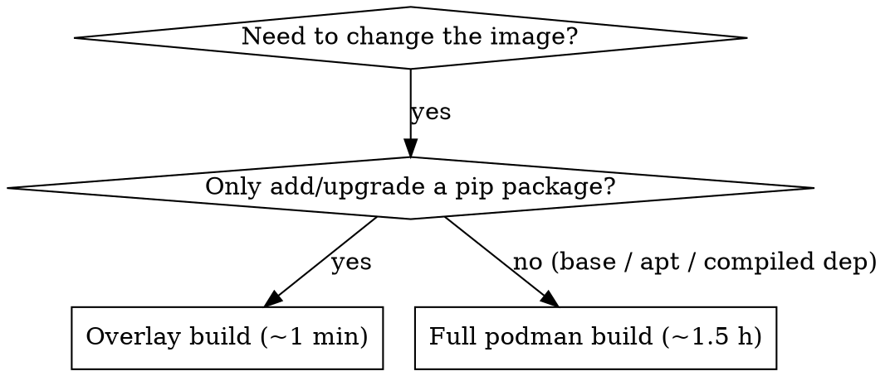

# CSCS Alps — Containers (enroot + pyxis)

On CSCS Alps the container runtime is **enroot** (rootless, unprivileged) plus the SLURM
**pyxis** plugin. Images are **squashfs `.sqsh`** files; jobs select one with
`srun --environment=<edf>`, where `<edf>` names an **EDF** (Environment Definition File)
TOML in `~/.edf/`. There is **no Apptainer / `.sif`** flow here.

Official docs: https://docs.cscs.ch/software/container-engine/

> **For Claude Code:** Two image operations matter.
> - **Full build** — podman (rootless) builds a Dockerfile, then `enroot import` converts
>   it to a `.sqsh`. Slow (~1–1.5 h), needed for base/system changes.
> - **Overlay build** — layer extra packages *on top of an existing `.sqsh`* with
>   `enroot create → start --rw → export`. Fast (~1 min for a pip bump), no podman.
>   **Prefer this** when you just need to add/upgrade a pip package in an existing image.

---

## The image model: `.sqsh` + EDF

A job runs in an image by naming an EDF:

```bash
(remote) $ srun -A infra02 --environment=flash-evolve-verl --pty bash
```

The EDF (`~/.edf/flash-evolve-verl.toml`) points at the squashfs and sets mounts/env:

```toml
image = "/capstor/store/cscs/swissai/infra01/xzyao/flash-evolve/images/flash-evolve-verl.aarch64.sqsh"

mounts = [
    "/capstor:/capstor",
    "/users/xyao:/users/xyao",
    "/iopsstor:/iopsstor",
]

workdir = "/capstor/store/cscs/swissai/infra02/xyao/code/flash-evolve"

[env]
HF_HOME    = "/capstor/store/cscs/swissai/infra02/xyao/cache/hf"
PYTHONPATH = "/capstor/store/cscs/swissai/infra02/xyao/code/flash-evolve"
CUDA_DEVICE_MAX_CONNECTIONS = "1"

[annotations]
com.hooks.aws_ofi_nccl.enabled = "true"   # Slingshot NCCL hook (Clariden multi-node)
com.hooks.aws_ofi_nccl.variant = "cuda12"
```

> **One-time setup:** copy the EDF into `~/.edf/` on each cluster (CSCS reads EDFs from the
> user's home, per cluster). The `image = ` path must point at the matching-arch `.sqsh`
> (`*.aarch64.sqsh` on Clariden, `*.x86_64.sqsh` on Bristen).
>
> **Gotcha:** the EDF `[env]` block **overrides** sbatch/runtime env (`PYTHONPATH`,
> `HF_HOME`, `workdir`). On wrong-import / wrong-path bugs, check the EDF **first**.

---

## Overlay build — add a pip package on top of an existing `.sqsh` (the fast path)

This is the canonical enroot "modify and re-export" flow. It unpacks an existing `.sqsh`,
installs into it read-write, and re-squashes to a **new** `.sqsh` — no podman rebuild.
A patch-level pip bump on a ~32 GB image takes **~1 minute**.

```
enroot create   $SRC_SQSH                  ->  unpack rootfs into $ENROOT_DATA_PATH
enroot start --root --rw ... pip install   ->  write new site-packages IN PLACE
enroot export   --output $DST_SQSH         ->  re-squash to a NEW .sqsh
```

Run it on a **compute node** (diskless → set every enroot path to `/dev/shm`). A ready
sbatch is in [examples/enroot-pip-overlay.sbatch](examples/enroot-pip-overlay.sbatch); the
core is:

```bash
# --- env: diskless GH200 node, /dev/shm is the only node-local store ---
SHM_ROOT=/dev/shm/$USER
export XDG_RUNTIME_DIR="$SHM_ROOT/run"
export ENROOT_DATA_PATH="$SHM_ROOT/enroot/data"
export ENROOT_CACHE_PATH="$SHM_ROOT/enroot/cache"
export ENROOT_RUNTIME_PATH="$SHM_ROOT/enroot/runtime"
export ENROOT_TEMP_PATH="$SHM_ROOT/enroot/temp"
unset DBUS_SESSION_BUS_ADDRESS || true     # stale user-bus socket is dead on compute nodes
mkdir -p "$XDG_RUNTIME_DIR" "$ENROOT_DATA_PATH" "$ENROOT_CACHE_PATH" \
         "$ENROOT_RUNTIME_PATH" "$ENROOT_TEMP_PATH"

NAME="overlay-$SLURM_JOB_ID"
enroot remove -f "$NAME" 2>/dev/null || true

enroot create --name "$NAME" "$SRC_SQSH"

enroot start --root --rw --env "PKG=flash-sandbox==0.2.8" "$NAME" bash -c '
    pip show flash-sandbox 2>/dev/null | grep -i "^Version:" || echo "(not installed)"
    pip install --no-cache-dir ${PKG}
    pip show flash-sandbox 2>/dev/null | grep -i "^Version:"
'

[ -f "$DST_SQSH" ] && rm -f "$DST_SQSH"
enroot export --output "$DST_SQSH" "$NAME" || echo "(export rc!=0; verify by size below)"
enroot remove -f "$NAME"
```

**Why each line matters:**
- `--rw` makes the rootfs writable **in place** (no ephemeral overlay), so `pip`'s writes
  persist into `$ENROOT_DATA_PATH/$NAME` and are captured by `enroot export`. Without
  `--rw`, changes are discarded.
- `--root` runs as root inside so `pip` can write to system `site-packages`.
- `--no-cache-dir` keeps the pip cache out of the exported image.
- enroot gives the container the host network, so `pip` reaches PyPI directly (Clariden
  compute nodes have outbound internet — the podman build pip-installs fine). If your site
  needs a proxy, forward `https_proxy`/`http_proxy` via `--env`.

**Rules:**
- **Write a NEW `.sqsh`** (e.g. `*.fs0.2.8.sqsh`); never overwrite `$SRC_SQSH` — a running
  job or the EDF may still reference it.
- **Verify by file size, not exit code** — `enroot export` (like `enroot import`) can exit
  non-zero *after* writing a good `.sqsh`. Check `>= 20 GB` for these images.
- **Adopt** the result by pointing the EDF `image = ` line at the new file, or — once
  validated and no job is reading it — `mv` the new file over the canonical name:
  ```bash
  ssh clariden "sed -i 's#NAME.aarch64.sqsh#NAME.aarch64.fs0.2.8.sqsh#' ~/.edf/<edf>.toml"
  ```

---

## Full build — Dockerfile → podman → `.sqsh` (the slow path)

For base-image / system-level changes, build the Dockerfile with rootless **podman** on a
compute node, then `enroot import` to a `.sqsh`. ~1–1.5 h. Submit one job per arch
(Clariden `aarch64`, Bristen `x86_64`).

```bash
(remote) $ sbatch -A infra02   meta/cscs/build/clariden.sbatch    # -> *.aarch64.sqsh
(remote) $ sbatch -A a-infra02 meta/cscs/build/bristen.sbatch     # -> *.x86_64.sqsh
```

Each gotcha below cost a failed build to find — they are baked into those sbatches:

| Gotcha | Fix |
|---|---|
| Diskless nodes: podman's overlay store cannot live on Lustre | Put the store on `/dev/shm/$USER` (RAM tmpfs) |
| `/dev/shm` is **not** reset between jobs; rootless podman leaves a store owned by mapped subuids + a live overlay mount that `rm -rf` can't remove | Clean with `podman system reset -f` **and** `podman unshare rm -rf` before building |
| Inherited `DBUS_SESSION_BUS_ADDRESS` (from `--export=ALL`) points at a **dead** user-bus socket on the compute node → podman aborts at STEP 1 with no useful error | `unset DBUS_SESSION_BUS_ADDRESS` (the single line between a STEP-1 death and a clean build) |
| Build log written **into** the build context corrupts the STEP-1 context tar → silent death | Write the log to a Lustre dir **outside** the context |
| Multi-GB runtime junk (`images/*.sqsh`, core dumps) bloats the context | `--ignorefile meta/.containerignore` |
| `enroot import` exits non-zero **after** writing a good `.sqsh` | Verify by file size (~32 GB), not exit code; build's final SLURM state is a benign `FAILED 1:0` |
| NCCL 2.27.5 (container-bundled) hangs on GH200 + Slingshot multi-node | Dockerfile pins `nvidia-nccl-cu12==2.30.4` + removes system libnccl |

> **Container-image creation needs the cluster's podman/enroot — build on a compute node
> via the sbatch, not locally.** The Dockerfile is arch-agnostic; the two build sbatches
> differ only in account + output filename.

---

## Decision: which build?



> Keep the **Dockerfile the source of truth**: when you overlay a pip bump, also update the
> pin in the Dockerfile so the next full rebuild matches the overlaid image.

---

## Common Mistakes

| Symptom | Cause / Fix |
|---|---|
| Build/overlay dies at STEP 1 in ~18 s, no error | Didn't `unset DBUS_SESSION_BUS_ADDRESS`, or log written into the context |
| `No space left on device` mid-build | enroot/podman paths not on `/dev/shm`; landed on a tiny home/Lustre quota |
| Overlay's `pip install` succeeded but the image still has the old version | Forgot `--rw` (changes discarded) — must be `enroot start --root --rw` |
| Job still runs the old image after rebuild | EDF `image = ` still points at the old `.sqsh` — repoint it or `mv` over the canonical name |
| Wrong PYTHONPATH / import despite setting it in the sbatch | EDF `[env]` overrides sbatch env — fix the EDF |
| Exit code non-zero but `.sqsh` looks fine | Known enroot quirk; verify by file size, not exit code |
